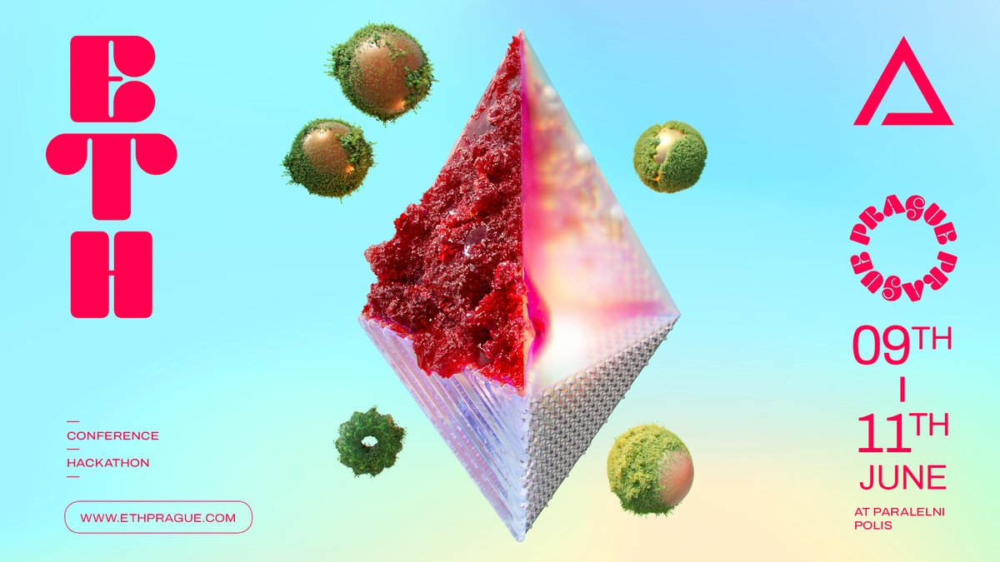

# 📘 Hacker Manual

## **TL;DR**

### **Before hackathon**

* Redeem your ticket&#x20;
* Join the conversation on [Telegram](hackers-manual/telegram.md)
* [Find a Team](hackers-manual/finding-a-team.md)

### During the hackathon - June 9-11, 2023

* **Register** at the[ venue](hackers-manual/venues.md)
* Mint your unique SBT token for Quadratic Voting
* Ask for help or guidance from our awesome [mentors](hackers-manual/mentors/)
* [Submit your project](hackers-manual/submissions.md) before the deadline&#x20;

### After the project submission deadline

* Take part in quadratic voting&#x20;

<figure><figcaption></figcaption></figure>

## Hackathon Introduction

ETHPrague is a hybrid event that combines a conference and a hackathon, with an additional track of talks and technical workshops designed to inspire and support the hackers.&#x20;

Throughout the entire weekend, you will have access to a dedicated space where you can work on your project, take breaks, and relax. This way, you can focus solely on bringing your ideas to life.

The capacity of the hackathon will be approximately **500 hackers**.&#x20;

Please note that only confirmed hackers will be able to participate in the event. All hackers will have full access to the ETHPrague conference as well.&#x20;

Please review hackathon rules [here](hackers-manual/hackathon-rules.md).&#x20;

### Hackathon themes

We encourage projects that address **sustainability**, **local economies**, **urban issues**, and any other ideas that contribute to a way leading to a **Solarpunk** utopia.

<mark style="color:orange;">The exact awards will be announced soon.</mark>

Voting on the quality of individual projects will not only be up to dedicated judges, but will also be decided by the hackathon participants themselves through quadratic voting.

ETHPrague Hackathon is organized by [Institute of Cryptoanarchy](https://www.paralelnipolis.cz/en/o-nas/) and [Duct Tape Production](https://ducttape.events/)

## Table of Contents


[schedule.md](hackers-manual/schedule.md)



[venues.md](hackers-manual/venues.md)



[food-and-drinks.md](hackers-manual/food-and-drinks.md)



[wi-fi-access.md](hackers-manual/wi-fi-access.md)



[hackathon-rules.md](hackers-manual/hackathon-rules.md)



[prizes-and-bounties](hackers-manual/prizes-and-bounties/)



[finding-a-team.md](hackers-manual/finding-a-team.md)



[mentors](hackers-manual/mentors/)



[submissions.md](hackers-manual/submissions.md)



[judging.md](hackers-manual/judging.md)



[quadratic-voting.md](hackers-manual/quadratic-voting.md)



[telegram.md](hackers-manual/telegram.md)


