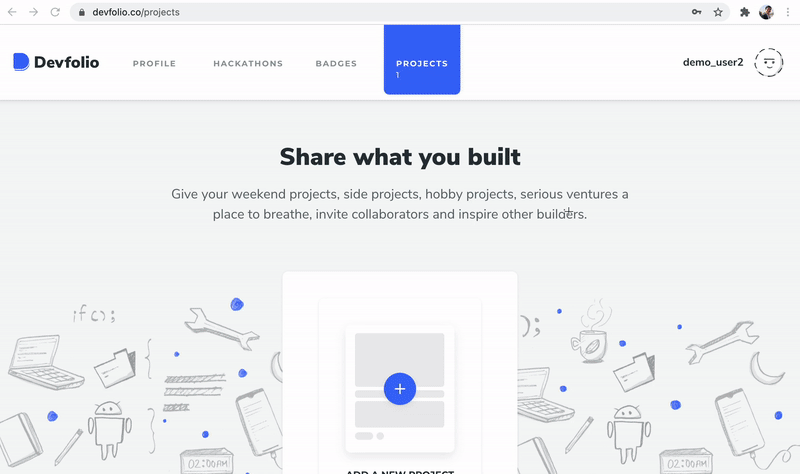
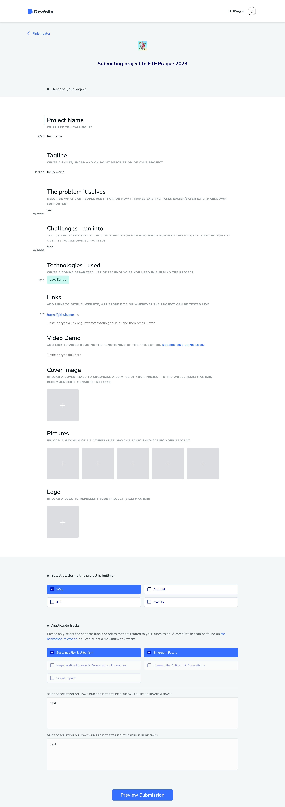

# 📩 Submissions


Please read the following information carefully, and reach out to [Ceci from ETHPrague team](https://t.me/hyperalchemy) or [Denver from Devfolio](https://t.me/denverjude) in the Telegram group if you have any question or issue.


### ETHPrague hackathon in **Devfolio:** [**hackathon.ethprague.com**](https://ethprague2023.devfolio.co)

**Devfolio documentation** [https://guide.devfolio.co/hackers/participate/project-submission](https://guide.devfolio.co/hackers/participate/project-submission)

**Devfolio FAQ** for hackers [https://guide.devfolio.co/hackers/faqs](https://guide.devfolio.co/hackers/faqs)

### **TL;DR**

* Create a profile for yourself on Devfolio. Create your own team or join an existing team if you want to collaborate with others. You can add more team members to your team later as well. Create and add your project.
* You can join to more teams, and one team can add and submit multiple projects.
* To maximize your chances of winning and to be able to present in front of the judges\*, you must submit the first draft of your project on Devfolio by **June 10, 2023, Saturday, at 4:00 pm**.
* Submit the final version of the project before **June 11, 2023, Sunday, 11:00 am**.

Follow these steps:

[#create-profile](submissions.md#create-profile "mention")

[#create-a-team](submissions.md#create-a-team "mention")

[#add-your-project](submissions.md#add-your-project "mention")

[#sumbit-your-project](submissions.md#sumbit-your-project "mention")

[#update-your-project-before-the-deadline](submissions.md#update-your-project-before-the-deadline "mention")

### **Create a profile in Devfolio** 

:information\_source: Whether you submit the project(s) Solo or as a Team, you must create a profile for yourself.

1. Go to [**hackathon.ethprague.com**](http://hackathon.ethprague.com)
2. Click on **Apply to Hack**&#x20;
   1. Verify your email (please use the same email address you used in your hacker application)
   2. Click on **Submit Application**

At this point your profile is created and you are in the ETHPrague hackathon dashboard.

### Create a team

You can choose to **Submit Solo** or **Submit as a Team**.

If you submit as a team, one member needs to create the team, and the others can simply add the team code to their dashboard.

1. Click on **Submit in Team**
2. One person per team will:
   1. Insert a team name and click **Create Team**
   2. Pass the generated code to your team members
3. The rest of the team members:
   1. Add the code into team code
   2. Click on **Join Team**
4. One person per team can click on **Add Project**

### Add Your Project

1. From the dashboard click **Add Project**&#x20;
2. Fill out the form.&#x20;

:information\_source: Please note that most of the fields are mandatory, but don't worry if you haven't figured them all out yet. You will be able to update them until submission, and no one will judge your project based on the early information you entered here. You can even simply enter TBD. Of course, the more you upload in the beginning and during the hackathon, the easier it will be to submit, so we encourage you not to leave everything to the last minute.

* **Project Name** (mandatory)
* **Tagline** (mandatory)
* **The problem it solves** (mandatory)
* **Challenges I ran into** (mandatory)
* **Technologies I used** (mandatory - 🚨 Important to apply for sponsor bounties! all info about sponsor bounties can be found [here](https://ethprague.gitbook.io/hackathon/hackers-manual/prizes-and-bounties/sponsored-bounties))

&#x20;:exclamation: **If you're building for a specific sponsor bounty, remember to tag the technology used.** :exclamation:

AAVE, API3, BASE, CHAINSAFE, ETHEREUM FOUNDATION ACCOUNT ABSTRACTION, ETHEREUM FOUNDATION PRIVACY & SCALING EXPLORATIONS, GNOSIS CHAIN & GATEWAY, LENS PROTOCOL, MAKER DAO, MANTLE, NEAR, OPTIMISM, PWN, SCROLL, TAIKO, THE GRAPH, ZKSYNC ERA

* **Links** (mandatory - here is where to add your repository, click “enter” to add a link)
* **Video, Cover Image, Pictures, Logo** (not mandatory but highly recommended!)
* **Select platform**: Web, Android, iOS, macOS (mandatory)
* **Applicable tracks** (mandatory - 🚨 Select max 2 solarpunk tracks: these are the awards you’ll be eligible for. All info about solarpunk awards can be found [here](https://ethprague.gitbook.io/hackathon/hackers-manual/prizes-and-bounties/solarpunk-awards))

3. Click **Preview Submission**
4. Click **Save Project**

_You are now back to your dashboard and you can Edit your project any time until the submission deadline._

### Sumbit Your Project

**💡 Note**: You can still edit your project before the deadline! [See how](submissions.md#update-your-project-before-the-deadline)

1. From the dashboard, click **Submit Project for Judging**
   * Click **Submit**


**Pre-Submission: Saturday 10th at 4PM**

If you want to have a chance to present in front of the judges, add the first draft of your project and submit before Saturday 4pm.

Judges will select few projects per category that will have a chance to present on Sunday.


Overview of all the steps:

<figure><figcaption></figcaption></figure>

### Update your Project (before the deadline)

Devfolio allows you to submit the project and continue editing as it keeps a history of all the changes. This is done through the 'Project' tab, see below

<figure><figcaption></figcaption></figure>


**Final** [**Submission Deadline: Sunday 11th at 11AM**](#user-content-fn-1)[^1]


**Example of a Project Submission Form:**

<figure><figcaption></figcaption></figure>

[^1]: 
