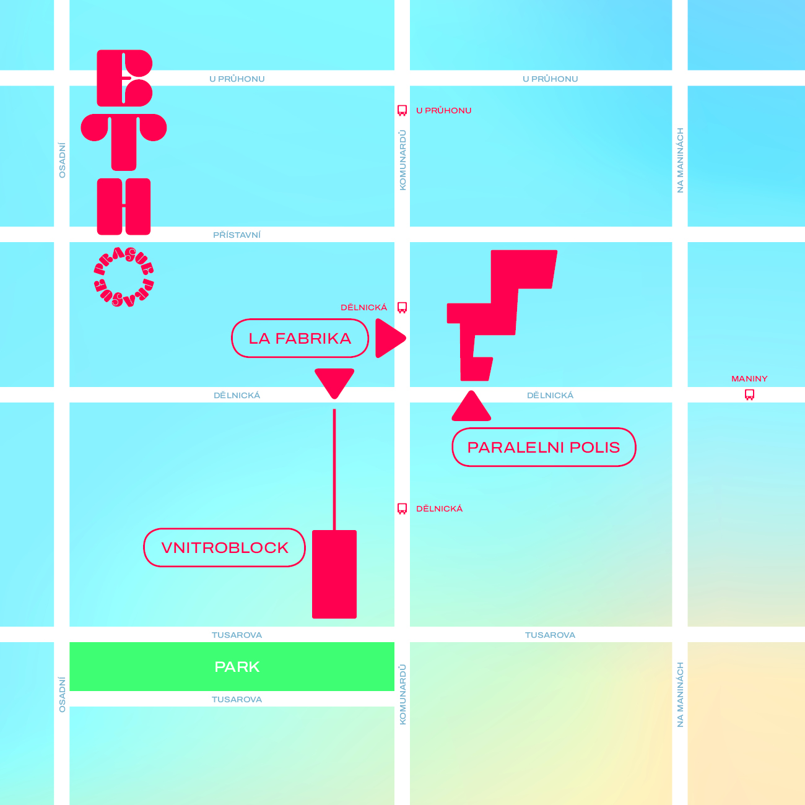

# 🏨 Venues

## **ETHPrague 2023** has two separate venues very close to each other:

* **Conference** - **Paralelní Polis &** **La Fabrika**
* **Hacker House - VNITROBLOCK**

### Conference - Paralelní Polis & **La Fabrika** (main venues)&#x20;

**Address:** 475/43, Dělnická, 170 00 Praha 7-Holešovice-


All hackers automatically have free access to both [Prague DeFi Summit](https://praguedefisummit.com/) (June 8-9) and the [ETHPrague](https://ethprague.com/) conference as well!


## Hacker House - VNITROBLOCK

**Address:** 32 Dělnická, 170 00 Praha 7-Holešovice [https://goo.gl/maps/5TWmcYYGZbgTxp526](https://goo.gl/maps/5TWmcYYGZbgTxp526)

This year, hackers will have 24-hour access to a separate Hacker House, just one block (80m) away from Paralelní Polis. This pretty awesome building with great inside garden vibes will provide ample space for productive work and focus for hacking, while also allowing for convenient access to the main conferences.

**Rest and sleep**

There will be room for resting and relaxing at the hacker house, but we still recommend having accommodations booked. There are many affordable options in Prague, and you can coordinate with fellow hackers in the Telegram group to share accommodations.

Please note that we can use the **North entrance** to access VNITROBLOCK, as displayed on the map below.

<figure><figcaption></figcaption></figure>
