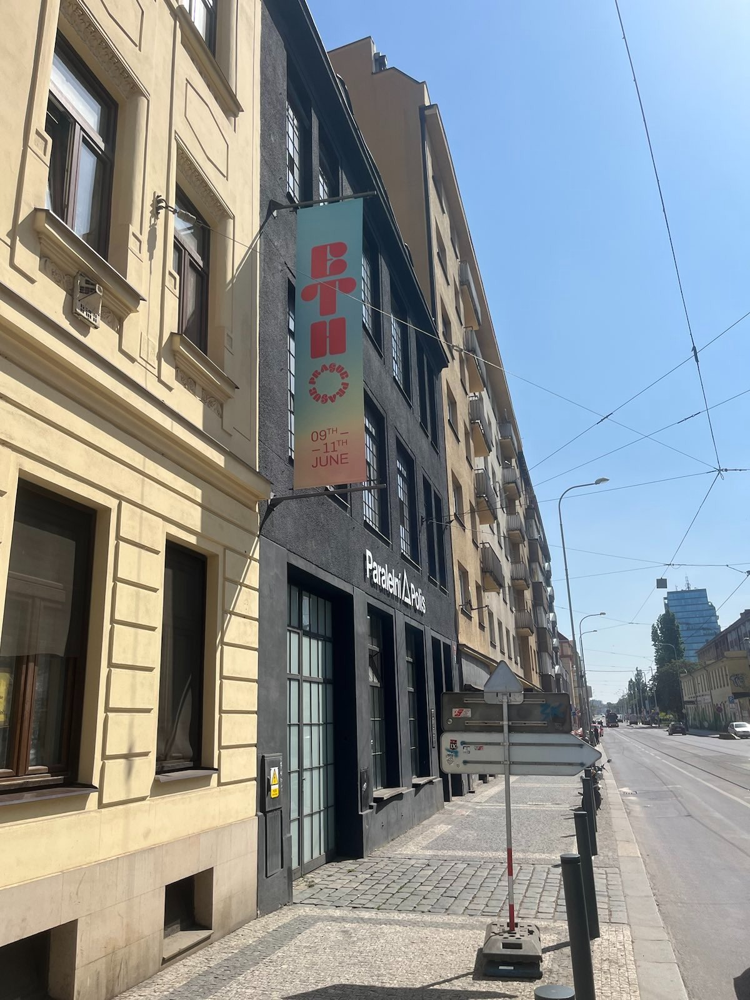
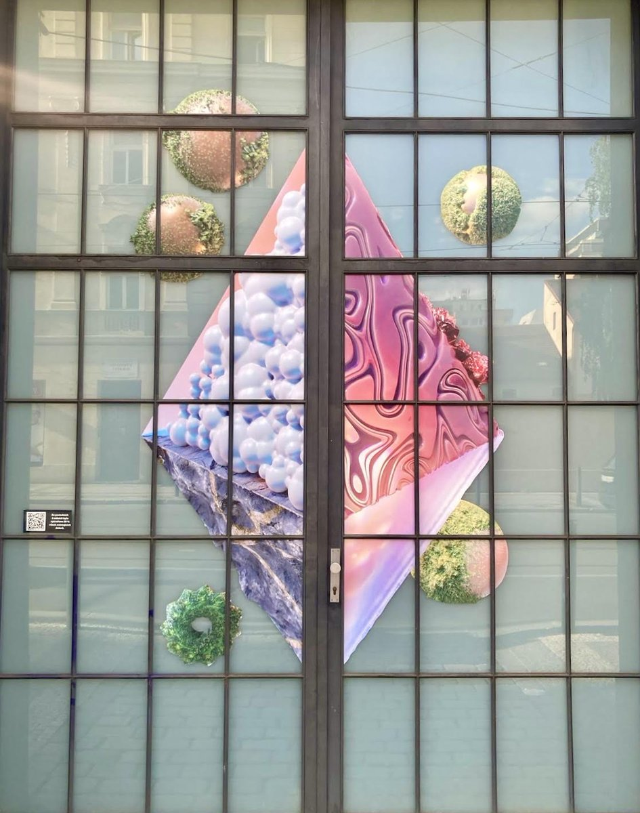
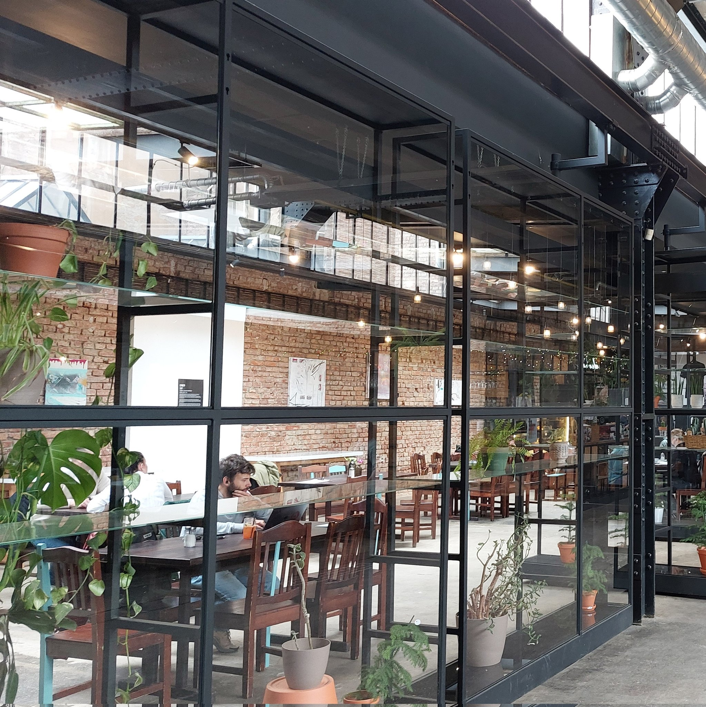
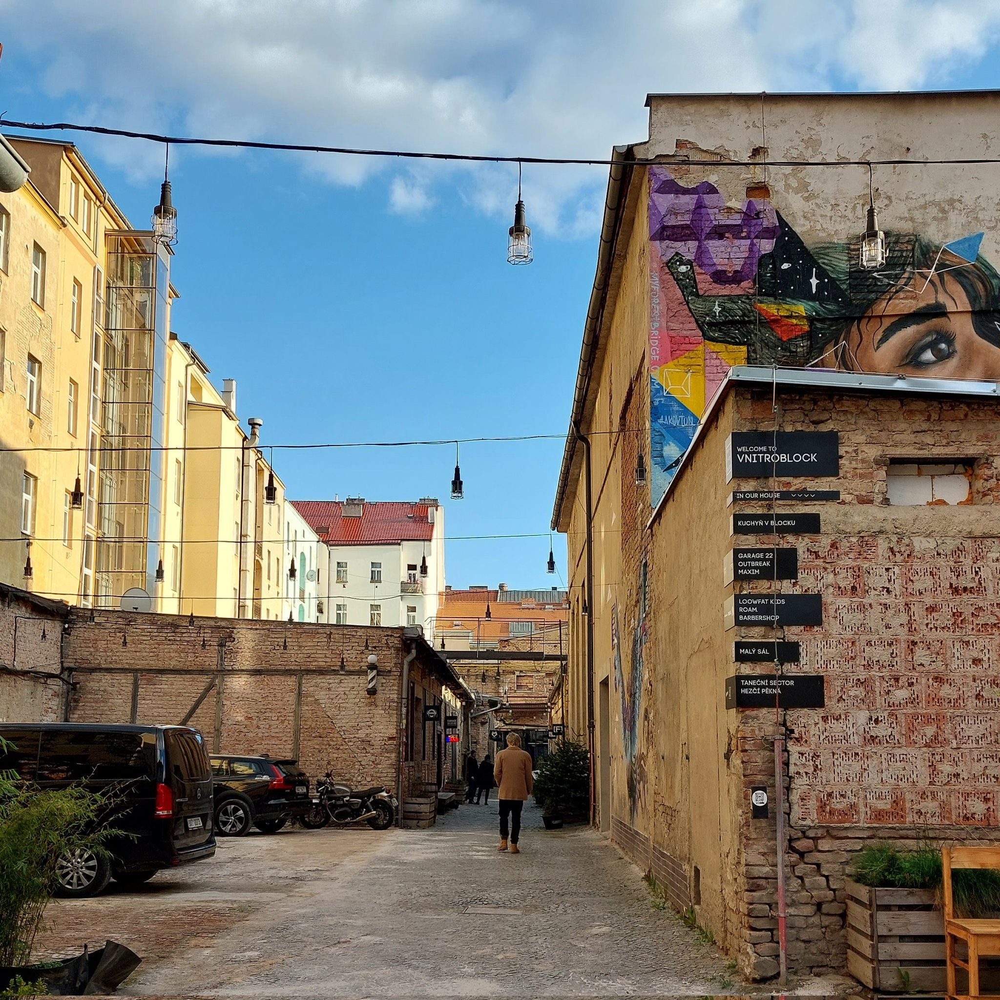

# 🏨 Venues

* **Conference** - **Paralelní Polis &** **La Fabrika**
* **Hacker House - VNITROBLOCK**

### Conference - Paralelní Polis & **La Fabrika** (main venues)&#x20;

**Address:** 475/43, Dělnická, 170 00 Praha 7-Holešovice-


All hackers automatically have free access to both [Prague DeFi Summit](https://praguedefisummit.com/) (June 8-9) and the [ETHPrague](https://ethprague.com/) conference as well!


<figure><figcaption></figcaption></figure>

 

<figure><figcaption></figcaption></figure>

## 🫡 Hacker House - VNITROBLOCK

**Address:** 32 Dělnická, 170 00 Praha 7-Holešovice [https://goo.gl/maps/5TWmcYYGZbgTxp526](https://goo.gl/maps/5TWmcYYGZbgTxp526)

This year, hackers will have 24-hour access to a separate Hacker House, just one block (80m) away from Paralelní Polis. This pretty awesome building with great inside garden vibes will provide ample space for productive work and focus for hacking, while also allowing for convenient access to the main conferences.

📍 During Friday and Sunday (9AM-10PM), VNITROBLOCK will be partially open to the public.&#x20;

You’ll still have access to the entire space, just be mindful of not leaving your stuff unattended in the area accessible to public. Our team of volunteers and security will be there to guide you if any question.

There’s a big open area on the ground floor, a cool basement and other cozy workplaces waiting for you. There will be room for resting and relaxing, but we still recommend having accommodations booked.

**The Hacker House is open 24h.**

Info about [meals at the Hacker House](food-and-drinks.md)

**Rest and sleep**

There will be room for resting and relaxing at the hacker house, but we still recommend having accommodations booked. There are many affordable options in Prague, and you can coordinate with fellow hackers in the Telegram group to share accommodations.

Please note that we can use the **North entrance** to access VNITROBLOCK, as displayed on the map below.

<figure><figcaption></figcaption></figure>
